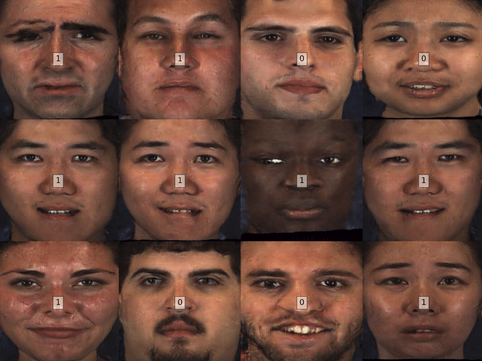
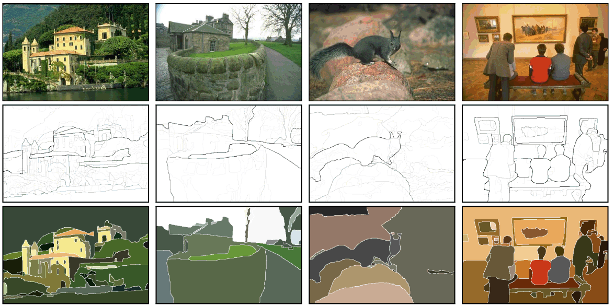

# Python tutorial
This is a basic tutorial on Python. We aim to cover general topics such as syntax and data structures, packaging, debugging, data loading and visualization.

## Warming up
- [ipython](https://ipython.org/)
- [Jupyter](http://jupyter.org/)

## Additional Info about LaTeX
- [Sharelatex](https://www.sharelatex.com)
- [Overleaf](https://www.overleaf.com/)
- [CVPR Author kit](http://cvpr2019.thecvf.com/files/cvpr2019AuthorKit.tgz)

## FYI - Requierements and dependencies installation
It is recommended to use Python [Anaconda](https://www.continuum.io/downloads) and its powerful package manager, [conda](https://github.com/conda/conda) to install additional packages.

--------------

# Homework

Please select one dataset of your preference. If you do not have one, you might use [BDSD](https://www2.eecs.berkeley.edu/Research/Projects/CS/vision/grouping/resources.htm). Your dataset _SHOULD_ have labels. 

Write a **python** script that does the following things:
1. Download (and untar if the case) your dataset. Here you can be *very* creative *i.e.*, you may use Dropbox, Drive, or anything you can access from a python module. 
2. Choose _randomly_ an specific number (Let's say **N**, N>6) of those images. Resize them to 256x256, and save them in a new folder. 
3. Plot the **N** images with the corresponding labels.
4. Delete the folder previously created. 

Let's explore the last item. On one hand, if you choose a classification problem, you might do it by showing the original images and something that tells the label of each one. For instance:

Where the label is depicted at the center of each image.

On the other hand, if you choose a detection/segmentation problem, you might do it by showing the original images with the corresponding groundtruths. For instance:

Where the first row are the original images, second and third row are the boundaries and segmentation grountruth respectively. 

---

Your script **must** be ONE SINGLE executable script that does all the aforementioned items just by typing: `./run.py`. Every time the script **must** choose different random images. 

Notes:
- Once the dataset has been downloaded, the script must skip step 1. 
- If you make use of a module that is rather uncommon (I do not know, nobody knows, internet is a weird place), just make sure that your script internally install it.
- Print the processing time at the end of the script. _time_ is the module you need for this purpose.

Bonus: 
- I could contemplate the posibility of a bonus if someone does not use the BDSD dataset. Be creative.
