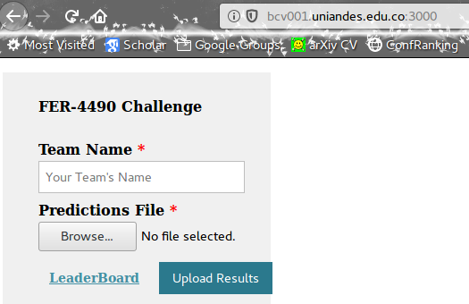
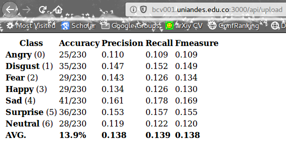

# Facial Emotion Recognition Challenge - IBIO4490

## Data

http://bcv001.uniandes.edu.co/Emotions_test.zip

- 1.160 total images, 230 images per class (7 classes).
- Faces **ARE NOT CENTERED NOR ARE THEY CROPPED**. Use an off-the-shelf face detector *e.g.,* Viola-Jones, HOG-SVM based, face detector python module, etc.


## Guidelines

- No more than **3** convolutional layers.
- No more than **2** fully connected layers (FC or linear layers) 
- It is strictly forbidden to use off-the-shelf networks such as LeNet, AlexNet, etc. 
- Use as many non-linear layers as you wish.
- Each **group** is allowed to submit up to **two times per day**.
- You are on your own, you are allowed to do any pre-processing and make any decision as long as you do not cheat. 


## Server 

The [**test server**](http://bcv001.uniandes.edu.co/contest) allow us to submit results and track the leaderboard.



### Submission

You need to create a **txt file** with the corresponding outputs for the whole test set (1.160 lines) as follows:

```
0000,3
0001,0
0002,3
0003,4
0004,6
0005,6
0006,5
0007,3
0008,3
0009,0
```

Then you select the file and upload it. Do not forget your team name. Once you submit your results, you should be able to get your scores (**only once, nobody will be able to see it after you close it**):



Then you go back to the home page and can track the leaderboard. You can also access the leaderboard using this link: http://bcv001.uniandes.edu.co/contest/leaderboard


# Now, be calm, take a deep breath, and... 

<p align="center"></p>

